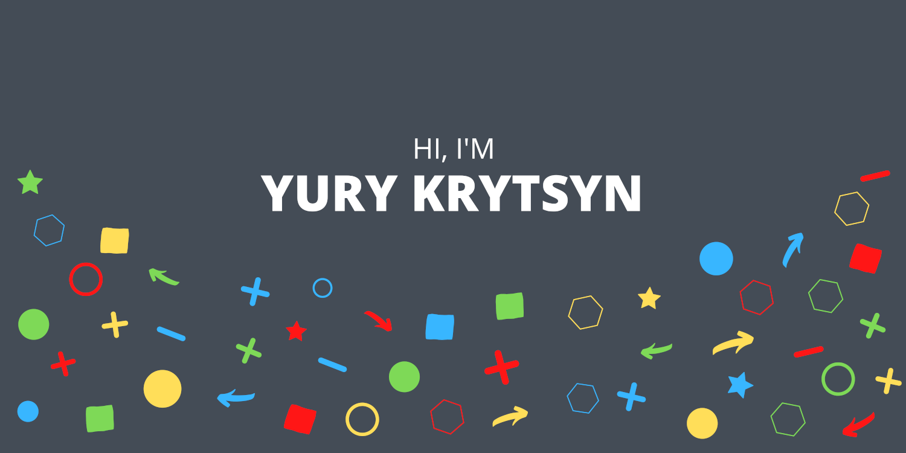

  

Hey there 👋

I'm Yury, a full-stack engineer, who specializes in back-end development (70%) and front-end development (30%). I strive to learn every day and accept new challenges at work and life. 

🔭 I’m currently working on 

🌱 I’m currently learning 
<!-- 👯 I’m looking to collaborate on ...
- 🤔 I’m looking for help with ...
- 💬 Ask me about ...
- 📫 How to reach me: ...
- 😄 Pronouns: ...
- ⚡ Fun fact: ...
-->

 

## Skills

<!-- details>

More Skills

<br-->

 

 

 

<!--
**ykrytsyn/ykrytsyn** is a ✨ _special_ ✨ repository because its `README.md` (this file) appears on your GitHub profile.

Here are some ideas to get you started:

-->
